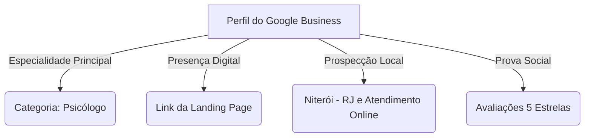

# Guia de Implantação no Google: Landing Page & Google Meu Negócio - Dra. Stéfane Mercês

Este guia detalha o passo a passo para colocar a nova Landing Page da **Dra. Stéfane Mercês** no ar, indexá-la no Google Search e criar/otimizar o seu perfil no **Google Business Profile (Google Meu Negócio)** para captação local de pacientes.

---

## 1. Publicação da Landing Page (Hospedagem & Domínio)

Para que o site seja acessível pelo Google, ele precisa estar hospedado em um servidor rápido e seguro (com certificado SSL/HTTPS obrigatório).

### Recomendações de Hospedagem:
*   **Vercel / Netlify (Recomendado):** Totalmente gratuito para projetos de landing page, com carregamento instantâneo global (CDN) e SSL automático. Perfeito para projetos em React + Vite.
*   **Hostinger / Locaweb:** Ideal se preferir um painel clássico e gerenciar e-mails corporativos (ex: `contato@stefanemerces.com.br`) sob o mesmo plano.

### Registro de Domínio:
*   Registre o domínio no **Registro.br** (ex: `stefanemerces.com.br` ou `stefanepsicologia.com.br`).
*   Aponte os servidores de DNS para a hospedagem escolhida.

---

## 2. Google Search Console (Indexação Orgânica)

O Search Console é a ferramenta gratuita do Google para monitorar, indexar e otimizar a presença do site nas buscas.

### Passo a Passo para Indexar o Site:
1.  Acesse o [Google Search Console](https://search.google.com/search-console) com a conta de e-mail profissional da Stéfane.
2.  Adicione uma nova propriedade. Escolha a opção **Domínio** (digite `stefanemerces.com.br`).
3.  **Verificação de Propriedade:** Copie o código TXT fornecido pelo Google e insira-o na zona de DNS do domínio (no Registro.br ou na sua hospedagem). Clique em *Verificar*.
4.  **Enviar Sitemap:** 
    *   Crie um arquivo simples `public/sitemap.xml` no projeto React (ele lista as páginas do site).
    *   No painel do Search Console, clique em **Sitemaps** no menu lateral e envie a URL (ex: `https://stefanemerces.com.br/sitemap.xml`).
5.  **Solicitar Indexação:** Cole a URL principal do site na barra de pesquisa superior ("Inspecionar URL") e clique em **Solicitar Indexação**. Isso força o Googlebot a ler e listar o site em poucas horas.

---

## 3. Configuração do Google Business Profile (Google Meu Negócio)

Para psicólogos, o **Google Business Profile** é o canal de captação orgânica mais poderoso. Ele faz com que a Stéfane apareça no mapa do Google quando alguém buscar por *"Psicóloga em Niterói"*, *"Psicólogo perto de mim"* ou pelo nome dela.

### Configurações Críticas para Ranqueamento:

1.  **Nome do Perfil:** Use o nome profissional associado à especialidade para ajudar o algoritmo de busca.
    *   *Recomendado:* **Dra. Stéfane Mercês | Psicóloga Clínica & Neuropsicologia**
2.  **Categoria Principal (A mais importante):** Defina estritamente como **Psicólogo**.
    *   *Categorias Secundárias:* "Clínica de psicologia", "Neuropsicólogo", "Serviço de saúde mental".
3.  **Endereço & Área de Cobertura:**
    *   *Se houver consultório físico:* Insira o endereço completo em Niterói para receber visitas presenciais.
    *   *Se o atendimento for 100% online:* Você pode ocultar o endereço residencial (marcando como "Área de Cobertura") e definir a área de atendimento como **Niterói - RJ** e **Brasil** (para sinalizar atendimento online em todo o país).
4.  **Informações de Contato:**
    *   Adicione o número de telefone (WhatsApp comercial).
    *   Insira o link da nova Landing Page no campo **Website**.
5.  **Fotos Profissionais (Aumentam cliques em 35%):**
    *   Adicione a foto de retrato profissional que geramos.
    *   Se houver consultório físico, tire fotos iluminadas e acolhedoras da sala de atendimento (transmite segurança ao paciente antes de agendar).
6.  **Descrição do Negócio (Até 750 caracteres):**
    *   *Exemplo de Copy:* "Dra. Stéfane Mercês é psicóloga e neuropsicóloga clínica especializada em terapias baseadas em evidências (TCC). Oferece psicoterapia individual online e presencial em Niterói, em um espaço seguro, acolhedor e ético, focado na singularidade de cada história. Auxilia pacientes a compreenderem seu funcionamento emocional, cognitivo e comportamental, promovendo autonomia e flexibilidade mental."
7.  **Avaliações (Prova Social):**
    *   Gere o link curto de avaliações no painel do Google Meu Negócio.
    *   Peça a pacientes antigos ou colegas de profissão que deixem um depoimento ético (sem expor dados sensíveis de pacientes) sobre a competência e acolhimento da Stéfane. Perfis com avaliações ativas ranqueiam muito mais alto.

---

## 4. Estrutura Técnica de SEO On-Page Aplicada

Para que o site performe de forma ideal no Google, o código gerado em `src/PsicologiaLanding.tsx` e `index.html` já conta com os pilares fundamentais do Google SEO:

*   **Títulos Semânticos (Hierarquia H1-H3):** Apenas um `<h1>` claro no Hero e subtítulos em `<h2>` e `<h3>`.
*   **Tags Open Graph (Compartilhamento):** Tags prontas para exibir um card elegante no WhatsApp ou Instagram quando a URL for enviada.
*   **Acessibilidade & Mobile First:** Layout 100% adaptável para smartphones, onde ocorrem mais de 80% das buscas por psicólogos.
*   **Botões de Ação Direta:** Fáceis de clicar no celular, direcionando o lead direto para o fluxo de triagem no WhatsApp.
